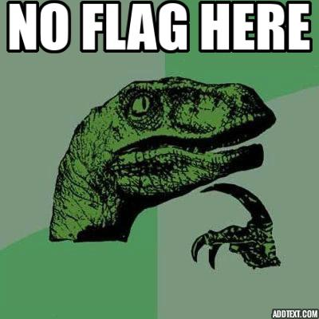
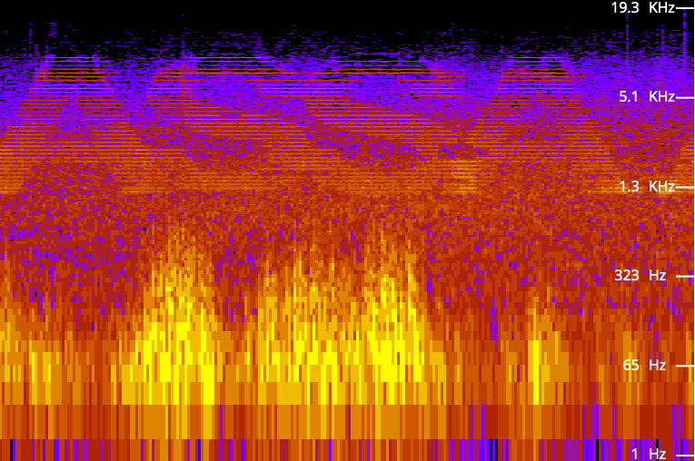
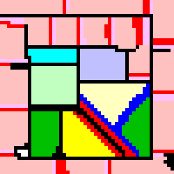

# CELEBRO CTF 2022

## OSINT - Door in the picture

Using `google` and `google maps` we found the correct street and found correct door
`FLAG: ASSAABLOY[august]`

## MISC - dino meme

Using `strings` we get found interesting string in results`heywhatsthat.heic` 

Using `binwalk` we found the archive with `heywhatsthat.heic` file inside. We extract it and the flag is
`FLAG: ASSAABLOY[BarelyWarmedUp]`
## MISC - evening traffic

First we convert `.ogg` to `.mp3` format.

Using Spectral Analysis (FFT) [TOOL](https://audiotoolset.com/spectral-analysis) we find flag.

`Flag: ASSAABLOY[3udAXhzUft]`

## MISC/WEB - Open the door

* **Opened Directory Scanner**:  
	dirb result:
	---- Scanning URL: https://ctf-door.herokuapp.com/ ----
	
	+ https://ctf-door.herokuapp.com/index.html (CODE:200|SIZE:1776)                                                                                                                
	+ https://ctf-door.herokuapp.com/solved (CODE:400|SIZE:12)                                                                                                                      
	+ https://ctf-door.herokuapp.com/start (CODE:200|SIZE:27) 

* Source code of the website didn't give us any hint.
* After many attempts we figured out that when entering the pin on the lock:  
	+ `single blink` means **incorrect** pin digit
	+ `double blink` means **correct** pin digit
* Above assumptions allowed us to open the lock and get the flag
                                                            

## MISTERY GRAPHIC
  
After research we found out that graphic describes **Esoteric programming language [PIET](https://esolangs.org/wiki/Piet)**   
Using [IDE](https://www.bertnase.de/npiet/) we can execute that code and get our flag.

