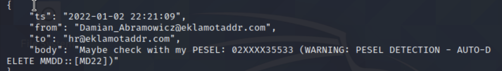
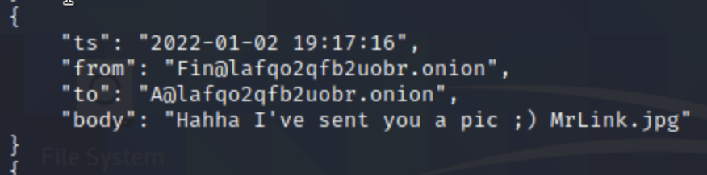
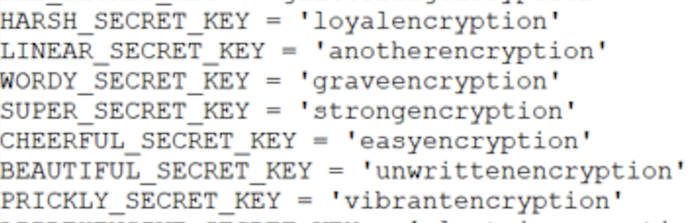
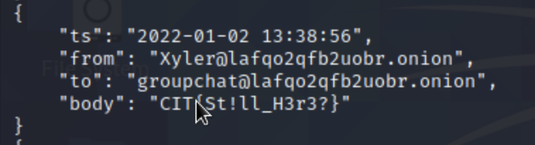
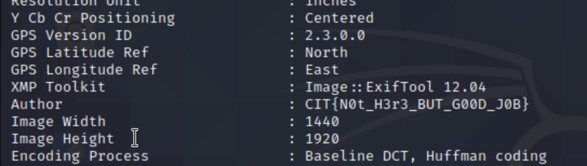

# Consult IT CTF
## Klocki
* Jakub Młocek
* Aga Patro


## Folder 1:

* Flag 1:
Going into folder 1 we can see `Xmyfiles.7z` password protected file. We use 7z2john to obtain file hash:
`Xmyfiles.7z:$7z$1$19$0$$8$695579e21423c29d0000000000000000$3980509154$224$209$3fdae4dd6e34989bc3c02a16be58a71b653ba80fa6aa7c3f94960c37d409026d6aa48ed9672bf9355bc7cccae3e665aa5caca80588ab732f7da44f5855109cab9a341d71ff63f67055ca595e6e7ec22631bae292284d0201966095e9bb796ddb9811f4bfbae218aab8e237aad0ae5eb08224df540a2332f89aae2090fb0b3e6b5eea5a31fd8637b954dd8b097616fc6cfc9afeb38e04bf7c582361cca8456c1f6921bec868a071a98225906c2c46bd4f2594f60a359d6a737dc7cb7ad985072251776357ab11597445c1a16409d6ea4f81fcf3f4bc5795814849b0cacc17fb57$318$5d00100000`  
Having hash we can than use Hashcat or JohnTheRipper to crack password. In our case we decided to use john with rockyou.txt wordlist. `sudo john hash.txt --wordlist=/usr/share/wordlists/rockyou.txt`
Finally we achieved password: `1q2w3e4r5t`
We can now access folder: `7z x Xmyfiles.7z` where we find our first flag in top_pass_reward.txt file.  
FLAG: `CIT{1234567shadowpasswd}`
  

* Flag 2: Inside Xmyfiles folder we can also find `excelfile.7z` and `dump.pcap file`. First attempt was to brutforce password as we did in previous example, but meanwhile i checked the binary of the `dump.pcap` file and found 3 interesting lines : `E331 Please specify the password.``PASS 742CITEKL9090$$` `U230 Login successful.` We can extract archive using `742CITEKL9090$$` passsword. Inside excelfile we can finde another 2 files: `note.txt` and `bossfile.7z`. The note is:  
"Note:
Hey! I'm sending you Damian Abramowicz files, password - his PESEL. Make sure you are using the right one. 
PS. Don't look for CIT, I moved it to next file. This had... questionable security." In `HR_talk.json` we found pattern for Damian's pesel: `02XXXX35533`  
.  
We generated wordlist for our usage using [exrex tool](https://github.com/asciimoo/exrex). After some tries with bruteforcing we started changing the control sum. It turned out to be a sollution. With control sum 4 we found pesel:
	`02220635534`. Inside bossfile is a FLAG: `CIT{SHHHARK&BRUTE}`

```python
import exrex

def checkSum(pesel):
    weights = [1,3,7,9,1,3,7,9,1,3,0]
    sum = 0
    for idx, num in enumerate(pesel):
        sum += int(num) * weights[idx]
    if 10 - (sum % 10) == int(pesel[-1]):
        return True
    else:
        return False


result = list(exrex.generate('^02[0-1][0-9][0-3][0-9]35533$'))
#result = [each[::-1] for each in result]
#result = [each for each in result if checkSum(each)]
result = "\n".join(result)

with open("wlist.txt", "w") as file:
    file.writelines(result)
```


## Folder 2:
* Flag 1: As vacations is a clue we binwalked and extracted metadata from all photos. In metadata of `paris-2295123123_1920.jpg` we can find "original coordinates": `35.658335, 139.745135` which is in Tokyo. Moreover inside the chat we found the information that the password is a city thet they met lastly + 9845!@#. Password is `Tokyo9845!@#`. Inside we can find our flag in `vacation_reward.txt` and flag is FLAG: `CIT{HOW_ABOUT_Y0ur_Vacation?}`
 

* Flag 2: In binary of dump.pcacp we found: 
```
Please login with USER and PASS
USER zachary 
PASS 742CITEKL9090$$
Login successful
Here comes the directory listing
Mar 18 11:11 msg.txt
```
Using 742CITEKL9090$$ we can extract new archive. We ended up with the same bossfile as in the folder1.


## Folder 3:
* Flag 1: In chat we found out that PIN to DYM242 is a data of birth of Damian. We can grab it from his pesel. Hint for the format is in `DYM242` (DDYYYYMM) so `06200202` is the pin. We get our Flag: `CIT{DYM_DONE_BOSS}`

## Folder 4:
* Flag 1: Name of the cat is mentioned in chat as "Mr Link". Looking througth the photos we found a cat with LINCOLN cup below. `Licoln` is a password for folder 4 and flag hidden in `osint_reward.txt` is FLAG: `CIT{0sINTisYourP0wer!}`

* Flag 2: Inside we found `encryptor.py`. Inside there was an os.environ.get() with many chars inside. We transalted it and it said `"SUPER_SECRET_KEY"`. We found that variable in avaliable env3.png. It's value is `strongencryption`.



## Folder All_other_files:
* Flag 1: Reading througth the `group_chat.json` on line 557 we found FLAG: `CIT{St!ll_H3r3?}` 
* Flag 2: using exiftool to look for metadata in all images, hidden flag occured in `saint-cirq-lapopie-2398843_1920.jpg`  FLAG: `CIT{N0t_H3r3_BUT_G00D_J0B}`

