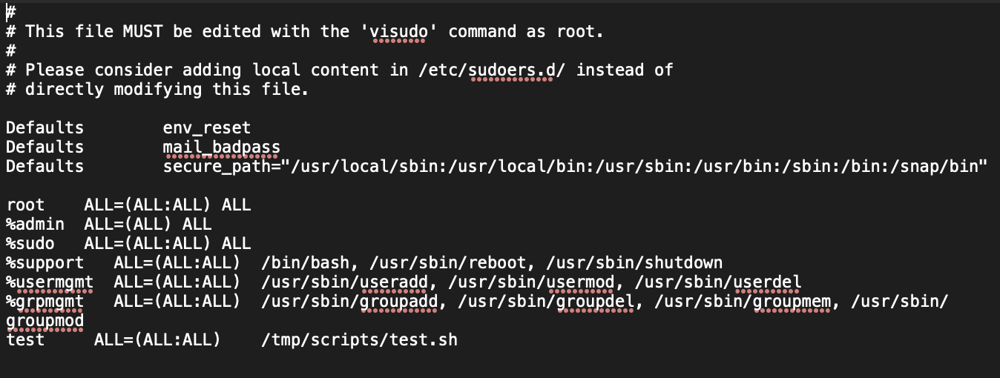
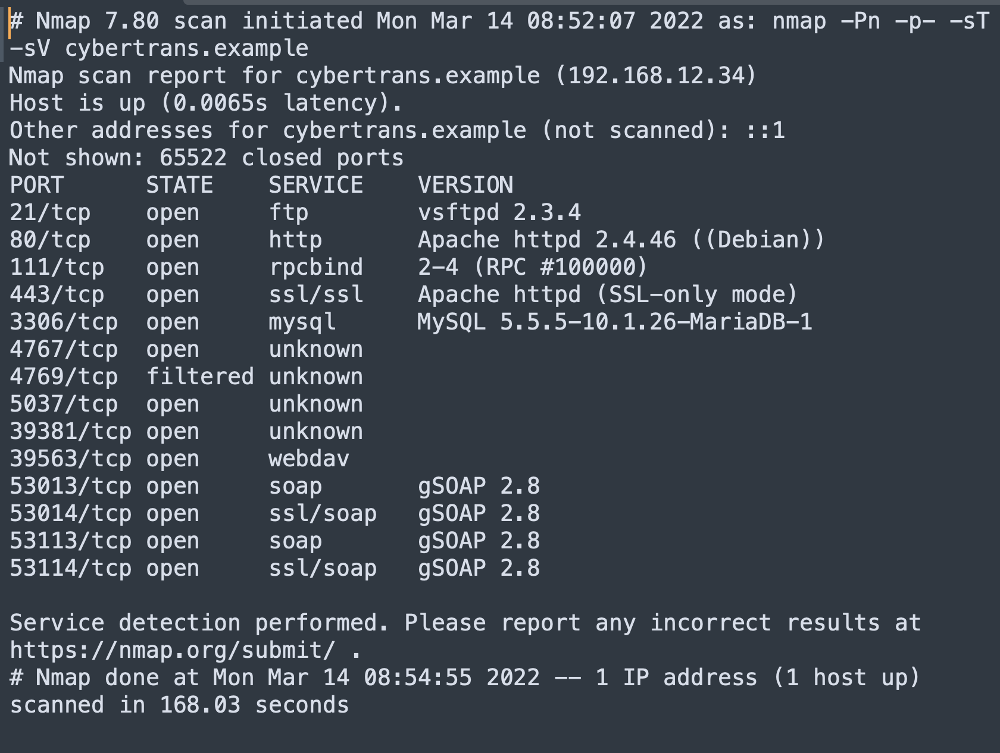
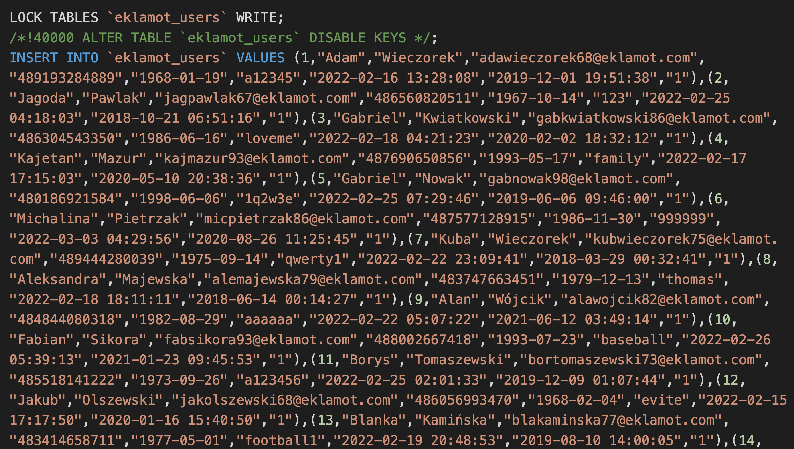
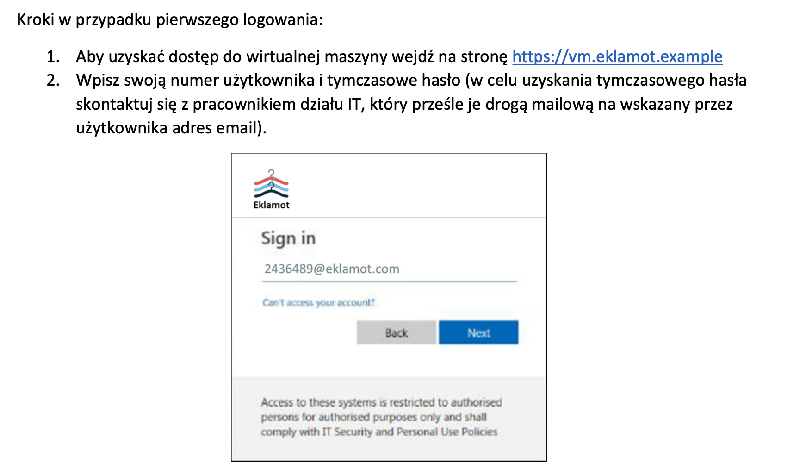
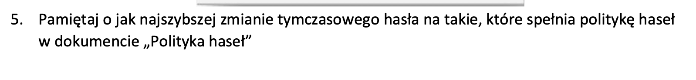
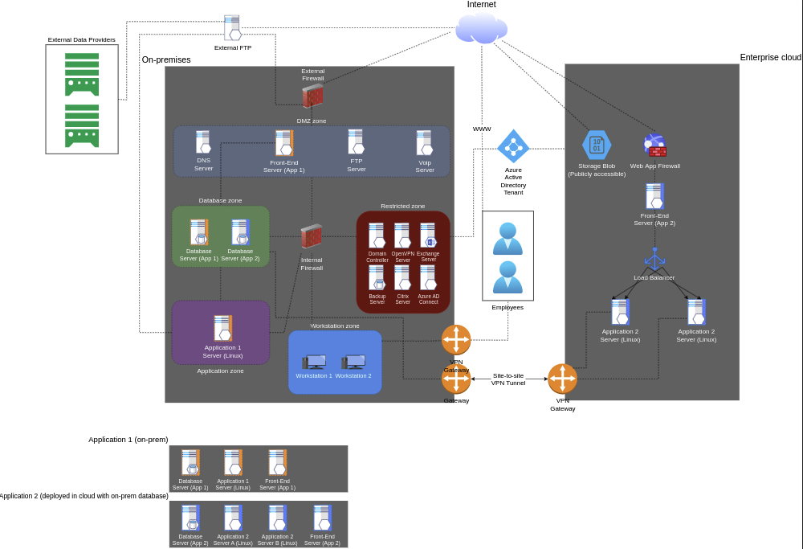

# CONSULT IT FINAL SECURITY

## Sudoers
### PSM
It's a good practice to have Privileged Session Manager. *PSM controls all IT manager sessions and creates video recordings of the devices in the network as well as virtual servers, and has the capacity to control any privileged session from start to the end. On the other hand, PSM can also monitor various network components such as employees, third parties and integrated systems via session control authorization.*   
*Utilized to monitor, manage and control encrypted manager sessions, PSM acts as a gateway between the session manager, users and the target endpoints. The man-in-the-middle approach, which is the fundamental reason behind Privileged Session Manager's operating principle to be such functional, eliminates the need to establish any middleware software in the target endpoints. Thanks to the man-in-the-middle approach, access portals or client applications are not required to establish connection.*
Having 
### Changes in Sudoers file
 * [Tutorial](https://blog.artmetic.pl/sudoers-nadawanie-uprawnien-zwyklym-uzytkownikom/)
 * `test     ALL=(ALL:ALL)    /tmp/scripts/test.sh` This line is potentialy dangerous. User test can execute with sudo privilages `test.sh` script which source code can be moddified. This means he can execute each command as a  root.
 * Group`%support` shouldn't have access to run /bin/bash as root. It also allows to run any avaliable commands as root which is't necessary for support.

 
 
## NMAP

### Ports to be opened
 * Having too many open ports expose servers to many potential attack vectors.
. Opened should remain only:
	 1. `21 (ftp)` for file transfer protocol.
	 2. `80 (http)` for website to be achieved.
	 3. `443 (https)` for secure website traffic.
	   
### Why close some ports
 * We decided to close port 111. RPC service has a history of security vulnerabilities. Having this port exposed allows everybody to query information without a need to authentication. It should be opened only for certain whitelist of IPs.
 * Port 3306 should also be closed. Exposing port 3306 can make our server vulnerable to attack. If a connection to database is necessary it is preffered to use ssh tunel instead.
 * Ports: 4767, 4769, 5037, 39381 haven't got any known reason to be oppened. We need documentation of applications for further decisions.
 * Port 39563 should be closed, webdav works on port 80 and 443 by default.
 * Ports: 53013, 53014, 53113, 53114 should be closed tempolary, becouse of [CVE-2021-21783](https://nvd.nist.gov/vuln/detail/CVE-2021-21783) vulnerability avaliable for gSOAP 2.8. 
 *  Moreover there is an [Exploit](https://www.exploit-db.com/exploits/49757) avaliable for ftp vsftpd 2.3.4 which is used in our application. It should be updated rapidly to the newest version.
 

## DataBase
 * Passwords should almost always be stored as hashes of hash function (f.e. sha-256) not a plain text. Hashes are irreversable, so even if the attacker will find our database, he has to put in lot's of effort to get plain text passwords.
 * Security of personal data of customers is extremaly important. Any potential leak can couse destructive consequences for whole company. As so database should be well protected
 

## Password Policy
 * We should force changing tempolary password after first login, not only kindly ask for it. It does not work in most cases.
 * Adding two-factor authorisation would be a great idea. Authenticator app on smartphone or pendrive auuthorisation to consider.
  
  
 
 
## Architecture
* Backup server should be accesible only for admin employess.
* Employess should not have access directry to restreicted zone. They need to connect to workstation zone by VPN or RCP first.
* Maybe a firewall between Front-End server and Database Server.
* Both Application2 should have access to database2.

### New architecture diagram:

## Zmiana Procesu Zarządzania Podatnościami w Eklamot

### Changes we suggest:
Security scanners are not ideal. We suggest using both famous Nessus and Nexpose for better quality. Morover even both can miss some dangerous vulnerabilities. As so we insist on sending those raports directly to security team. Security team would then extend reasearch.

### Final Process:
 1. Prepare a scan request - If there is a need for scanning, the request is made by the System Administrator.
 2. Preparation and execution of the scan with Nessus and Nexpose (complementary tools)
 3. Provide the results of the scan to the Security Team.
 4. The Security Team deepens the vulnerability search.
 5. If vulnerabilities are found, they are forwarded to the system administrator with a report describing them.
 6. Is a deviation required? A decision point that determines if a deviation is required within the vulnerabilities found. The system administrator reviews and decides whether a derogation request is required.
 7. Prepare a deviation request -- If the system administrator decides a deviation is required, the system administrator prepares an appropriate request with justification, which it sends to the Security Team
 8. Perform corrective action -- If no deviation request is required, the System Administrator proceeds to implement the planned corrective action.
 9. Report completion of corrective action -- Upon completion of the action, the System Administrator reports its completion to the Security Team.
 10. Has the variance request been approved? - A decision point that determines whether the deviation request has been accepted by the Security Team. If the request is accepted, the Security Team prepares an appropriate summary. If the request is not accepted, the system administrator must take corrective action.
 11. Prepare Summary - The Security Team prepares an appropriate summary depending on whether the process resulted in the implementation of corrective actions to address the vulnerabilities discovered or the acceptance of the deviation request.

