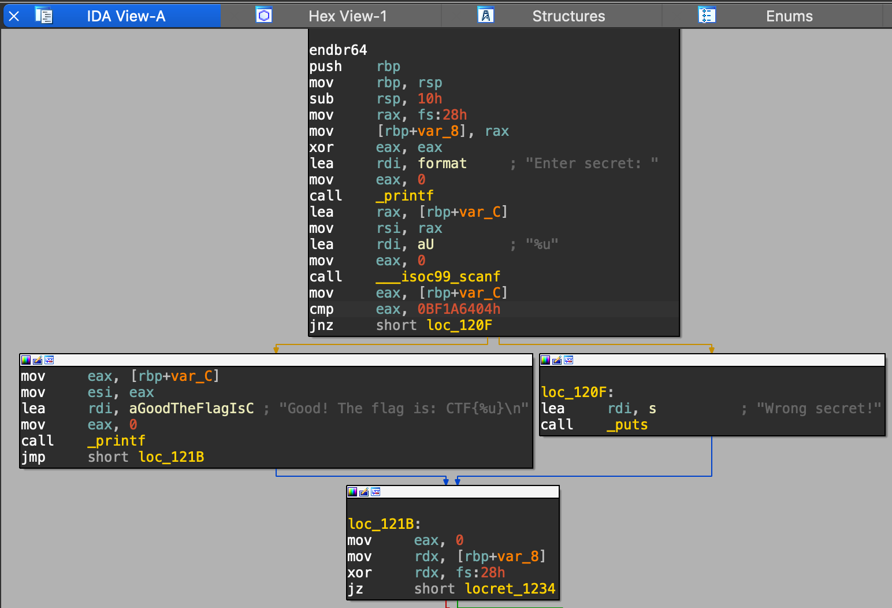
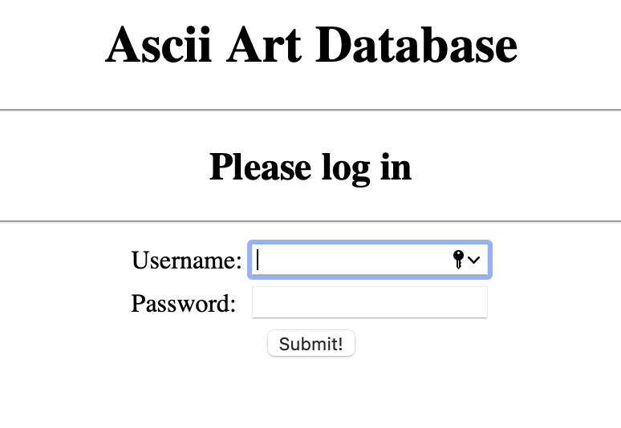
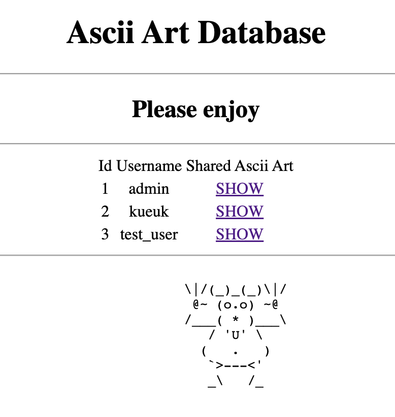
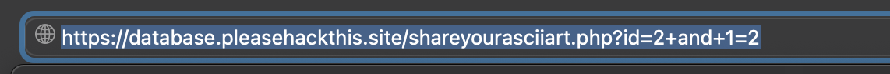
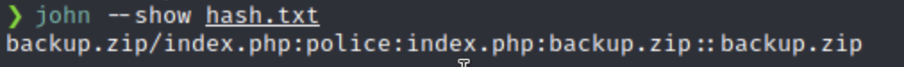
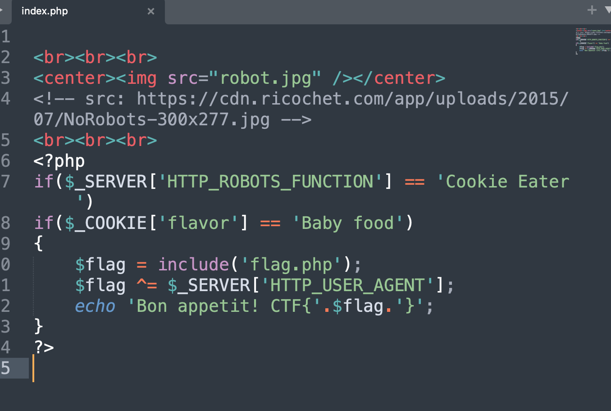
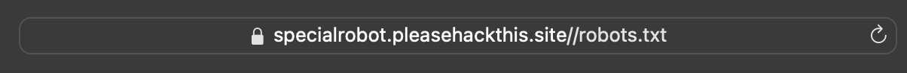
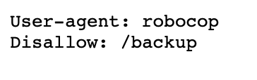

# Cybersec CTF 2022

## Sanity Check
Just entered the ctf discord and flag is in the topic. FLAG: CTF{Welcome\_2\_CYBERSEC2022}

## Secret Number
Using reverse enginierring tool [IDA](https://hex-rays.com/ida-free/) we could find out fragment below. We can see cmp function that compares input to '0BF1A6404h' which is `3206177796` decimal. FLAG: `CTF{3206177796}`


## Baby Database
Firsly I performed SQL Injection. Our query `SELECT 1 FROM users WHERE username='$username' AND password='$password'`. So as we input `' OR 1=1 LIMIT 1 --` as login it will always return True. We logged in!



Firstly I tried `http://www.webshop.local/item.php?id=14 and 1=1` and ascii was displaied normally. Than I tried `http://www.webshop.local/item.php?id=14 and 1=2` and nothing was displayed. That meabs there is an Blind SQL injection vulnerability on the website. To get admin login we try `https://database.pleasehackthis.site/shareyourasciiart.php?id=3%20UNION%20SELECT%20password%20from%20users%20ORDER%20BY%201%20DESC%20LIMIT%202,1` and password `https://database.pleasehackthis.site/shareyourasciiart.php?id=3 UNION SELECT password from users ORDER BY 1 DESC LIMIT 2,1` FLAG: `CTF{DoNotInjectAtHome}`

## Special Robot
We are welcomed by the empty site with just an image. Looking into `https://specialrobot.pleasehackthis.site//robots.txt` link we can see that robots.txt contains two lines: 
```User-agent: robocop     
Disallow: /backup```  
Inside `http://specialrobot.pleasehackthis.site/backup/` is a zip archive that I have downloaded. Using `zip2john` and `JohnTheRipper` tool I cracked the hash and the password for zip archive is `police`. Inside archive we can finde php file.
```php  
<br><br><br>
<center></center>
<!-- src: https://cdn.ricochet.com/app/uploads/2015/07/NoRobots-300x277.jpg -->
<br><br><br>
<?php
if($_SERVER['HTTP_ROBOTS_FUNCTION'] == 'Cookie Eater')
if($_COOKIE['flavor'] == 'Baby food')
{
	$flag = include('flag.php');
	$flag ^= $_SERVER['HTTP_USER_AGENT'];
	echo 'Bon appetit! CTF{'.$flag.'}';
}
?>
```
We need to edit our cookie





