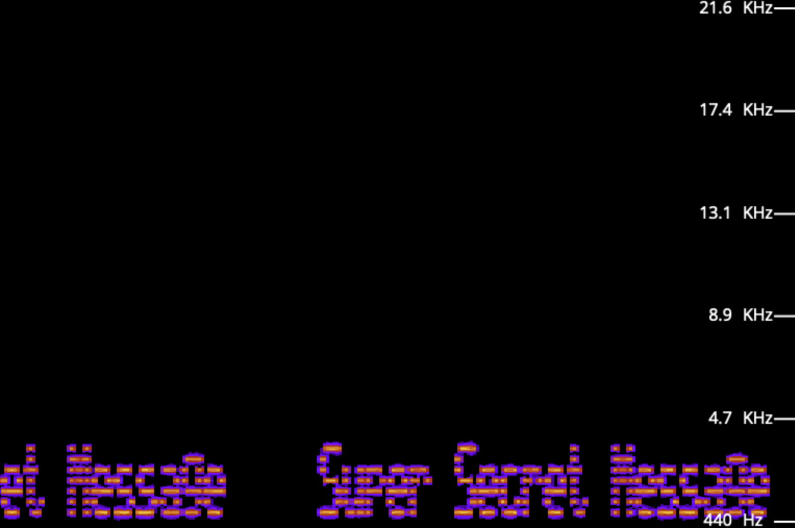

# Try Hack Me c4ptur3-th3-fl4g CTF

## Task1
* `c4n y0u c4p7u23 7h3 f149?`  
Easy to read, answer: `can you capture the flag`
* ```01101100 01100101 01110100 01110011 00100000 01110100 01110010 01111001 00100000 01110011 01101111 01101101 01100101 00100000 01100010 01101001 01101110 01100001 01110010 01111001 00100000 01101111 01110101 01110100 00100001```
Just convert binary code to ascii, answer: `lets try some binary out!`
* `MJQXGZJTGIQGS4ZAON2XAZLSEBRW63LNN5XCA2LOEBBVIRRHOM======`
Just convert Base32 to ascii, answer: `base32 is super common in CTF'sz`
* `RWFjaCBCYXNlNjQgZGlnaXQgcmVwcmVzZW50cyBleGFjdGx5IDYgYml0cyBvZiBkYXRhLg`
Just convert Base64 to ascii, answer: `Each Base64 digit represents exactly 6 bits of data.`
* `68 65 78 61 64 65 63 69 6d 61 6c 20 6f 72 20 62 61 73 65 31 36 3f`
Just convert heximal to ascii, answer: `hexadecimal or base16?`
* `Ebgngr zr 13 cynprf!`
Just decrypt ROT13 (13 times cesar cipher) to ascii, anser: `Rotate me 13 places!`
* `*@F DA:? >6 C:89E C@F?5 323J C:89E C@F?5 Wcf E:>6DX`
Just decrypt ROT47 (47 times cesar cipher) to ascii, anser: `You spin me right round baby right round (47 times)`
* ```- . .-.. . -.-. --- -- -- ..- -. .. -.-. .- - .. --- -.
. -. -.-. --- -.. .. -. --.
```
Just convert morse to ascii, answer: `TELECOMMUNICATION  ENCODING`
* `85 110 112 97 99 107 32 116 104 105 115 32 66 67 68`
Just convert base10 to ascii, answer: `Unpack this BCD`  

* LS0tLS0gLi0tLS0gLi0tLS0gLS0tLS0gLS0tLS0gLi0tLS0gLi0tLS0gLS0tLS0KLS0tLS0gLi0tLS0gLi0tLS0gLS0tLS0gLS0tLS0gLi0tLS0gLS0tLS0gLi0tLS0KLS0tLS0gLS0tLS0gLi0tLS0gLS0tLS0gLS0tLS0gLS0tLS0gLS0tLS0gLS0tLS0KLS0tLS0gLi0tLS0gLi0tLS0gLS0tLS0gLS0tLS0gLS0tLS0gLS0tLS0gLS0tLS0KLS0tLS0gLi0tLS0gLS0tLS0gLi0tLS0gLi0tLS0gLi0tLS0gLi0tLS0gLi0tLS0KLS0tLS0gLi0tLS0gLi0tLS0gLS0tLS0gLS0tLS0gLS0tLS0gLS0tLS0gLS0tLS0KLS0tLS0gLS0tLS0gLi0tLS0gLS0tLS0gLS0tLS0gLS0tLS0gLS0tLS0gLS0tLS0KLS0tLS0gLi0tLS0gLi0tLS0gLS0tLS0gLS0tLS0gLS0tLS0gLS0tLS0gLS0tLS0KLS0tLS0gLi0tLS0gLi0tLS0gLS0tLS0gLS0tLS0gLS0tLS0gLS0tLS0gLS0tLS0KLS0tLS0gLi0tLS0gLi0tLS0gLS0tLS0gLS0tLS0gLi0tLS0gLS0tLS0gLi0tLS0KLS0tLS0gLS0tLS0gLi0tLS0gLS0tLS0gLS0tLS0gLS0tLS0gLS0tLS0gLS0tLS0KLS0tLS0gLi0tLS0gLi0tLS0gLS0tLS0gLS0tLS0gLS0tLS0gLi0tLS0gLS0tLS0KLS0tLS0gLi0tLS0gLi0tLS0gLS0tLS0gLi0tLS0gLS0tLS0gLS0tLS0gLS0tLS0KLS0tLS0gLS0tLS0gLi0tLS0gLS0tLS0gLS0tLS0gLS0tLS0gLS0tLS0gLS0tLS0KLS0tLS0gLi0tLS0gLi0tLS0gLS0tLS0gLS0tLS0gLS0tLS0gLS0tLS0gLS0tLS0KLS0tLS0gLi0tLS0gLi0tLS0gLS0tLS0gLS0tLS0gLS0tLS0gLS0tLS0gLS0tLS0KLS0tLS0gLi0tLS0gLi0tLS0gLS0tLS0gLS0tLS0gLi0tLS0gLS0tLS0gLS0tLS0KLS0tLS0gLS0tLS0gLi0tLS0gLS0tLS0gLS0tLS0gLS0tLS0gLS0tLS0gLS0tLS0KLS0tLS0gLi0tLS0gLi0tLS0gLS0tLS0gLS0tLS0gLS0tLS0gLi0tLS0gLS0tLS0KLS0tLS0gLi0tLS0gLi0tLS0gLS0tLS0gLS0tLS0gLS0tLS0gLS0tLS0gLi0tLS0KLS0tLS0gLS0tLS0gLi0tLS0gLS0tLS0gLS0tLS0gLS0tLS0gLS0tLS0gLS0tLS0KLS0tLS0gLi0tLS0gLi0tLS0gLS0tLS0gLS0tLS0gLS0tLS0gLS0tLS0gLS0tLS0KLS0tLS0gLi0tLS0gLS0tLS0gLi0tLS0gLi0tLS0gLi0tLS0gLi0tLS0gLi0tLS0KLS0tLS0gLi0tLS0gLi0tLS0gLS0tLS0gLi0tLS0gLS0tLS0gLS0tLS0gLS0tLS0KLS0tLS0gLS0tLS0gLi0tLS0gLS0tLS0gLS0tLS0gLS0tLS0gLS0tLS0gLS0tLS0KLS0tLS0gLi0tLS0gLi0tLS0gLS0tLS0gLi0tLS0gLS0tLS0gLS0tLS0gLS0tLS0KLS0tLS0gLi0tLS0gLi0tLS0gLS0tLS0gLS0tLS0gLi0tLS0gLi0tLS0gLS0tLS0KLS0tLS0gLS0tLS0gLi0tLS0gLS0tLS0gLS0tLS0gLS0tLS0gLS0tLS0gLS0tLS0KLS0tLS0gLi0tLS0gLi0tLS0gLS0tLS0gLS0tLS0gLS0tLS0gLS0tLS0gLS0tLS0KLS0tLS0gLi0tLS0gLS0tLS0gLi0tLS0gLi0tLS0gLi0tLS0gLi0tLS0gLi0tLS0KLS0tLS0gLi0tLS0gLi0tLS0gLS0tLS0gLS0tLS0gLi0tLS0gLi0tLS0gLS0tLS0KLS0tLS0gLS0tLS0gLi0tLS0gLS0tLS0gLS0tLS0gLS0tLS0gLS0tLS0gLS0tLS0KLS0tLS0gLi0tLS0gLi0tLS0gLS0tLS0gLS0tLS0gLS0tLS0gLS0tLS0gLS0tLS0KLS0tLS0gLi0tLS0gLS0tLS0gLi0tLS0gLi0tLS0gLi0tLS0gLi0tLS0gLi0tLS0KLS0tLS0gLi0tLS0gLi0tLS0gLS0tLS0gLS0tLS0gLS0tLS0gLS0tLS0gLS0tLS0KLS0tLS0gLS0tLS0gLi0tLS0gLS0tLS0gLS0tLS0gLS0tLS0gLS0tLS0gLS0tLS0KLS0tLS0gLi0tLS0gLi0tLS0gLS0tLS0gLS0tLS0gLS0tLS0gLi0tLS0gLS0tLS0KLS0tLS0gLi0tLS0gLi0tLS0gLS0tLS0gLS0tLS0gLS0tLS0gLS0tLS0gLi0tLS0KLS0tLS0gLS0tLS0gLi0tLS0gLS0tLS0gLS0tLS0gLS0tLS0gLS0tLS0gLS0tLS0KLS0tLS0gLi0tLS0gLi0tLS0gLS0tLS0gLS0tLS0gLS0tLS0gLS0tLS0gLS0tLS0KLS0tLS0gLi0tLS0gLi0tLS0gLS0tLS0gLS0tLS0gLS0tLS0gLS0tLS0gLS0tLS0KLS0tLS0gLi0tLS0gLi0tLS0gLS0tLS0gLS0tLS0gLi0tLS0gLS0tLS0gLi0tLS0KLS0tLS0gLS0tLS0gLi0tLS0gLS0tLS0gLS0tLS0gLS0tLS0gLS0tLS0gLS0tLS0KLS0tLS0gLi0tLS0gLi0tLS0gLS0tLS0gLS0tLS0gLS0tLS0gLS0tLS0gLS0tLS0KLS0tLS0gLi0tLS0gLS0tLS0gLi0tLS0gLi0tLS0gLi0tLS0gLi0tLS0gLi0tLS0KLS0tLS0gLi0tLS0gLi0tLS0gLS0tLS0gLS0tLS0gLS0tLS0gLi0tLS0gLi0tLS0KLS0tLS0gLS0tLS0gLi0tLS0gLS0tLS0gLS0tLS0gLS0tLS0gLS0tLS0gLS0tLS0KLS0tLS0gLi0tLS0gLi0tLS0gLS0tLS0gLS0tLS0gLS0tLS0gLS0tLS0gLS0tLS0KLS0tLS0gLi0tLS0gLS0tLS0gLi0tLS0gLi0tLS0gLi0tLS0gLi0tLS0gLi0tLS0KLS0tLS0gLi0tLS0gLi0tLS0gLS0tLS0gLS0tLS0gLi0tLS0gLS0tLS0gLS0tLS0KLS0tLS0gLS0tLS0gLi0tLS0gLS0tLS0gLS0tLS0gLS0tLS0gLS0tLS0gLS0tLS0KLS0tLS0gLi0tLS0gLi0tLS0gLS0tLS0gLS0tLS0gLS0tLS0gLS0tLS0gLS0tLS0KLS0tLS0gLi0tLS0gLi0tLS0gLS0tLS0gLS0tLS0gLS0tLS0gLS0tLS0gLS0tLS0KLS0tLS0gLi0tLS0gLi0tLS0gLS0tLS0gLS0tLS0gLi0tLS0gLS0tLS0gLS0tLS0KLS0tLS0gLS0tLS0gLi0tLS0gLS0tLS0gLS0tLS0gLS0tLS0gLS0tLS0gLS0tLS0KLS0tLS0gLi0tLS0gLi0tLS0gLS0tLS0gLS0tLS0gLS0tLS0gLi0tLS0gLS0tLS0KLS0tLS0gLi0tLS0gLi0tLS0gLS0tLS0gLS0tLS0gLS0tLS0gLS0tLS0gLi0tLS0KLS0tLS0gLS0tLS0gLi0tLS0gLS0tLS0gLS0tLS0gLS0tLS0gLS0tLS0gLS0tLS0KLS0tLS0gLi0tLS0gLi0tLS0gLS0tLS0gLi0tLS0gLS0tLS0gLS0tLS0gLS0tLS0KLS0tLS0gLi0tLS0gLi0tLS0gLS0tLS0gLS0tLS0gLi0tLS0gLi0tLS0gLS0tLS0KLS0tLS0gLS0tLS0gLi0tLS0gLS0tLS0gLS0tLS0gLS0tLS0gLS0tLS0gLS0tLS0KLS0tLS0gLi0tLS0gLi0tLS0gLS0tLS0gLS0tLS0gLS0tLS0gLi0tLS0gLS0tLS0KLS0tLS0gLi0tLS0gLi0tLS0gLS0tLS0gLS0tLS0gLS0tLS0gLS0tLS0gLi0tLS0KLS0tLS0gLS0tLS0gLi0tLS0gLS0tLS0gLS0tLS0gLS0tLS0gLS0tLS0gLS0tLS0KLS0tLS0gLi0tLS0gLi0tLS0gLS0tLS0gLi0tLS0gLS0tLS0gLS0tLS0gLS0tLS0KLS0tLS0gLi0tLS0gLi0tLS0gLS0tLS0gLS0tLS0gLi0tLS0gLi0tLS0gLi0tLS0KLS0tLS0gLS0tLS0gLi0tLS0gLS0tLS0gLS0tLS0gLS0tLS0gLS0tLS0gLS0tLS0KLS0tLS0gLi0tLS0gLi0tLS0gLS0tLS0gLS0tLS0gLS0tLS0gLS0tLS0gLS0tLS0KLS0tLS0gLi0tLS0gLS0tLS0gLi0tLS0gLi0tLS0gLi0tLS0gLi0tLS0gLi0tLS0KLS0tLS0gLi0tLS0gLi0tLS0gLS0tLS0gLS0tLS0gLi0tLS0gLS0tLS0gLS0tLS0KLS0tLS0gLS0tLS0gLi0tLS0gLS0tLS0gLS0tLS0gLS0tLS0gLS0tLS0gLS0tLS0KLS0tLS0gLi0tLS0gLi0tLS0gLS0tLS0gLS0tLS0gLS0tLS0gLS0tLS0gLS0tLS0KLS0tLS0gLi0tLS0gLi0tLS0gLS0tLS0gLS0tLS0gLS0tLS0gLS0tLS0gLS0tLS0KLS0tLS0gLi0tLS0gLi0tLS0gLS0tLS0gLS0tLS0gLi0tLS0gLS0tLS0gLi0tLS0KLS0tLS0gLS0tLS0gLi0tLS0gLS0tLS0gLS0tLS0gLS0tLS0gLS0tLS0gLS0tLS0KLS0tLS0gLi0tLS0gLi0tLS0gLS0tLS0gLS0tLS0gLS0tLS0gLi0tLS0gLS0tLS0KLS0tLS0gLi0tLS0gLi0tLS0gLS0tLS0gLS0tLS0gLS0tLS0gLS0tLS0gLi0tLS0KLS0tLS0gLS0tLS0gLi0tLS0gLS0tLS0gLS0tLS0gLS0tLS0gLS0tLS0gLS0tLS0KLS0tLS0gLi0tLS0gLi0tLS0gLS0tLS0gLS0tLS0gLS0tLS0gLS0tLS0gLS0tLS0KLS0tLS0gLi0tLS0gLi0tLS0gLS0tLS0gLS0tLS0gLS0tLS0gLS0tLS0gLS0tLS0KLS0tLS0gLi0tLS0gLi0tLS0gLS0tLS0gLS0tLS0gLi0tLS0gLS0tLS0gLi0tLS0KLS0tLS0gLS0tLS0gLi0tLS0gLS0tLS0gLS0tLS0gLS0tLS0gLS0tLS0gLS0tLS0KLS0tLS0gLi0tLS0gLi0tLS0gLS0tLS0gLS0tLS0gLS0tLS0gLS0tLS0gLS0tLS0KLS0tLS0gLi0tLS0gLi0tLS0gLS0tLS0gLS0tLS0gLS0tLS0gLS0tLS0gLS0tLS0KLS0tLS0gLi0tLS0gLi0tLS0gLS0tLS0gLS0tLS0gLS0tLS0gLi0tLS0gLi0tLS0KLS0tLS0gLS0tLS0gLi0tLS0gLS0tLS0gLS0tLS0gLS0tLS0gLS0tLS0gLS0tLS0KLS0tLS0gLi0tLS0gLi0tLS0gLS0tLS0gLS0tLS0gLS0tLS0gLS0tLS0gLS0tLS0KLS0tLS0gLi0tLS0gLS0tLS0gLi0tLS0gLi0tLS0gLi0tLS0gLi0tLS0gLi0tLS0KLS0tLS0gLi0tLS0gLi0tLS0gLS0tLS0gLS0tLS0gLi0tLS0gLS0tLS0gLS0tLS0KLS0tLS0gLS0tLS0gLi0tLS0gLS0tLS0gLS0tLS0gLS0tLS0gLS0tLS0gLS0tLS0KLS0tLS0gLi0tLS0gLi0tLS0gLS0tLS0gLi0tLS0gLS0tLS0gLS0tLS0gLS0tLS0KLS0tLS0gLi0tLS0gLi0tLS0gLS0tLS0gLi0tLS0gLS0tLS0gLS0tLS0gLS0tLS0KLS0tLS0gLS0tLS0gLi0tLS0gLS0tLS0gLS0tLS0gLS0tLS0gLS0tLS0gLS0tLS0KLS0tLS0gLi0tLS0gLi0tLS0gLS0tLS0gLS0tLS0gLS0tLS0gLS0tLS0gLS0tLS0KLS0tLS0gLi0tLS0gLS0tLS0gLi0tLS0gLi0tLS0gLi0tLS0gLi0tLS0gLi0tLS0KLS0tLS0gLi0tLS0gLi0tLS0gLS0tLS0gLS0tLS0gLi0tLS0gLi0tLS0gLS0tLS0KLS0tLS0gLS0tLS0gLi0tLS0gLS0tLS0gLS0tLS0gLS0tLS0gLS0tLS0gLS0tLS0KLS0tLS0gLi0tLS0gLi0tLS0gLS0tLS0gLS0tLS0gLS0tLS0gLS0tLS0gLS0tLS0KLS0tLS0gLi0tLS0gLS0tLS0gLi0tLS0gLi0tLS0gLi0tLS0gLi0tLS0gLi0tLS0KLS0tLS0gLi0tLS0gLi0tLS0gLS0tLS0gLS0tLS0gLi0tLS0gLS0tLS0gLS0tLS0KLS0tLS0gLS0tLS0gLi0tLS0gLS0tLS0gLS0tLS0gLS0tLS0gLS0tLS0gLS0tLS0KLS0tLS0gLi0tLS0gLi0tLS0gLS0tLS0gLS0tLS0gLS0tLS0gLS0tLS0gLS0tLS0KLS0tLS0gLi0tLS0gLS0tLS0gLi0tLS0gLi0tLS0gLi0tLS0gLi0tLS0gLi0tLS0KLS0tLS0gLi0tLS0gLi0tLS0gLS0tLS0gLS0tLS0gLS0tLS0gLS0tLS0gLS0tLS0KLS0tLS0gLS0tLS0gLi0tLS0gLS0tLS0gLS0tLS0gLS0tLS0gLS0tLS0gLS0tLS0KLS0tLS0gLi0tLS0gLi0tLS0gLS0tLS0gLS0tLS0gLS0tLS0gLS0tLS0gLS0tLS0KLS0tLS0gLi0tLS0gLi0tLS0gLS0tLS0gLS0tLS0gLS0tLS0gLS0tLS0gLS0tLS0KLS0tLS0gLi0tLS0gLi0tLS0gLS0tLS0gLS0tLS0gLS0tLS0gLi0tLS0gLi0tLS0KLS0tLS0gLS0tLS0gLi0tLS0gLS0tLS0gLS0tLS0gLS0tLS0gLS0tLS0gLS0tLS0KLS0tLS0gLi0tLS0gLi0tLS0gLS0tLS0gLS0tLS0gLS0tLS0gLi0tLS0gLi0tLS0KLS0tLS0gLi0tLS0gLi0tLS0gLS0tLS0gLS0tLS0gLi0tLS0gLS0tLS0gLi0tLS0KLS0tLS0gLS0tLS0gLi0tLS0gLS0tLS0gLS0tLS0gLS0tLS0gLS0tLS0gLS0tLS0KLS0tLS0gLi0tLS0gLi0tLS0gLS0tLS0gLS0tLS0gLS0tLS0gLi0tLS0gLi0tLS0KLS0tLS0gLi0tLS0gLi0tLS0gLS0tLS0gLS0tLS0gLi0tLS0gLS0tLS0gLi0tLS0KLS0tLS0gLS0tLS0gLi0tLS0gLS0tLS0gLS0tLS0gLS0tLS0gLS0tLS0gLS0tLS0KLS0tLS0gLi0tLS0gLi0tLS0gLS0tLS0gLS0tLS0gLS0tLS0gLi0tLS0gLi0tLS0KLS0tLS0gLi0tLS0gLi0tLS0gLS0tLS0gLS0tLS0gLi0tLS0gLS0tLS0gLi0tLS0=
Solution is to combine all techniques we used before:  
 1) Base64  
 2) Morse code  
 3) Binary to ASCII  
 4) ROT 47  
 5) BCD to ASCII  
 

## Task 2

I used spectrum analizer [Tool](https://audiotoolset.com/spectral-analysis) on given file. The output shows our flag: `Super Secret Message` 