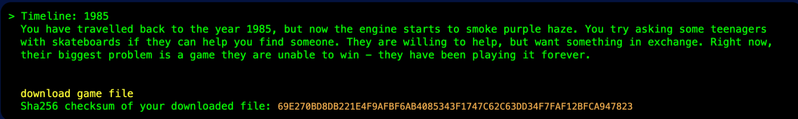

SFI CTF 2023 Jakub Młocek

## cryptic_website

Pasting it somewhere gives us flag

sfi18_ctf{HelloThere!}

## crawlers

https://ctf.sfi.pl/robots.txt

## wild_west

Comparing this two maps we get rebus as below:

OREGON=KANSAS+OHIO searched in google [https://www.youtube.com/watch?v=ebNXNtmUNbQ&ab_channel=AptitudeWorldNATUS](https://www.google.com/url?q=https://www.youtube.com/watch?v%3DebNXNtmUNbQ%26ab_channel%3DAptitudeWorldNATUS&sa=D&source=editors&ust=1680772426477642&usg=AOvVaw08vtrDtJiHWcKyKhkdg76H)

Solution is RGSEKOINHA

## la_bouche

I have made a screenshot of this alphabet and pasted it into google search.

[https://www.pinterest.com/pin/4081455896165462/](https://www.google.com/url?q=https://www.pinterest.com/pin/4081455896165462/&sa=D&source=editors&ust=1680772426478742&usg=AOvVaw3ti8y-F6TvNEvHLhD-VMum)

[https://www.dafont.com/pigpencodefont.font](https://www.google.com/url?q=https://www.dafont.com/pigpencodefont.font&sa=D&source=editors&ust=1680772426479090&usg=AOvVaw2qjRFnX49F8CvZRPOR3JBp)

Wydaje się to być szyfr pigpen [https://en.wikipedia.org/wiki/Pigpen_cipher](https://www.google.com/url?q=https://en.wikipedia.org/wiki/Pigpen_cipher&sa=D&source=editors&ust=1680772426479476&usg=AOvVaw0V-5qQvYTee_Wjo7Xy91x7)

https://www.boxentriq.com/code-breaking/pigpen-cipher

Plaintext: RYJUQYWWLILIFJ

sfi{RYJUQYWWLILIFJ} is not correct. Further investigation and using the name of the exercise made the solution. It supposed to be La Bauche cipher:

[https://en.wikipedia.org/wiki/Olivier_Levasseur](https://www.google.com/url?q=https://en.wikipedia.org/wiki/Olivier_Levasseur&sa=D&source=editors&ust=1680772426480132&usg=AOvVaw0cYpiEvImW23Fidy39Z0Y2)

Po rozszyfrowaniu flaga to: sfi{quavoussererla}

## vpong_game

Using strings command I looked for a flag in plaintext. Surprisingly it appeared:

## 

## Post Office

Code of the site contains a comment encoded in base 64.

<!-- aW5kZXgucGhwCmxvZ2luIGFkbWluCnBhc3N3b3JkIHNmaXNmaXNmaQ== →

decoded in cyberchef:

        

Let’s open Burp Suite and modify the GET request to POST. We need also add two body fields login=admin and password=sfisfisfi to get a response with a flag

sfi18_ctf{IwannaPOSTtheflag}

*   ## camera_model

There are 3 files inside given zip

The note is:

We can get many metadata from the photo using exiftool or other similar software. I used online one [www.aperisolve.com](https://www.google.com/url?q=http://www.aperisolve.com&sa=D&source=editors&ust=1680772426483055&usg=AOvVaw2WPzoUtXEhxvaxDkytfx60) 

I have tried enormous combination for deep.zip file the one that fits in was SamsungS22

We got another zip inside 

HashIdentifier told us that it’s SHA-1 checksum. Let’s brute force it using hashcat and rockyou dictionary.

In the end using the note we need to change black -> emerald

emerald_pearl261981 is password for zip inside which is the flag.txt file: sfi18_ctf{C0ngR4tUl4t10n5}

## Photo

On the left side of the picture we can see flower shop and it’s phone number. After searching for it in the internet it figured out to be this one: [https://katalog.swiatkwiatow.pl/firma/210,magia-kwiatow-alicja-michajlow.html](https://www.google.com/url?q=https://katalog.swiatkwiatow.pl/firma/210,magia-kwiatow-alicja-michajlow.html&sa=D&source=editors&ust=1680772426484521&usg=AOvVaw3H531s0FNTMQyUgAjR_NpF) 

We use google street view to be on a given street. On the wicket we're looking for is caption “Krakowska 50”

Szukana flaga to: krakowska50

## binary_code

Translating binary to text ([https://www.rapidtables.com/convert/number/binary-to-ascii.html](https://www.google.com/url?q=https://www.rapidtables.com/convert/number/binary-to-ascii.html&sa=D&source=editors&ust=1680772426485450&usg=AOvVaw1JfFB1wZUuR6tILr3ZbDGe))

address command

1.  LOAD @ 12
2.  STORE @ 14
3.  LOAD @ 13
4.  SUB $ 1
5.  JZERO $ 11
6.  STORE @ 13
7.  LOAD @ 14
8.  MULT @ 12
9.  STORE @ 14
10.  JUMP $ 3
11.  END $ 0
12.  5
13.  3
14.  0

[https://ii.uni.wroc.pl/~hkr/Wdi/wyklady/Wyklad12.pdf](https://www.google.com/url?q=https://ii.uni.wroc.pl/~hkr/Wdi/wyklady/Wyklad12.pdf&sa=D&source=editors&ust=1680772426486646&usg=AOvVaw0HbSBVJ4ew3sG9VXzHcw9u) 

        It is some kind of Assembly code. Iterating through it we can deduce that we are multiplying number 5 each iteration. Flaga is sfi18_ctf{125}

